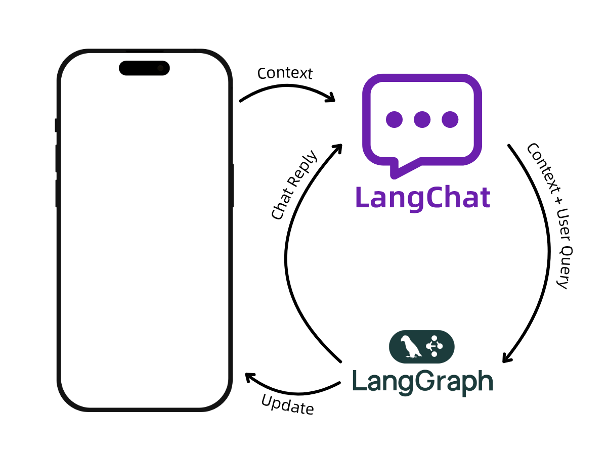

# LangChat - React Native AI Chat Package

A comprehensive React Native package for building AI-powered chat applications with Supabase backend and LangGraph AI integration.

## Features

- 🤖 **AI-Powered Conversations**: Seamless integration with LangGraph for intelligent responses
- 🔐 **Authentication**: Built-in Supabase authentication system
- 💬 **Real-time Chat**: Live message streaming and real-time updates
- 📁 **File Support**: Upload and share files, images, and documents
- 🎨 **Theming**: Customizable light/dark themes with extensible theming system
- 📱 **React Native**: Optimized for mobile-first experience
- 🔧 **Easy Setup**: Minimal configuration required



## Installation

```bash
npm install @alpha.xone/langchat
# or
yarn add @alpha.xone/langchat
```

### Peer Dependencies

Make sure you have the following peer dependencies installed:

```bash
npm install react react-native
```

## Quick Start

1. **Environment Setup**

Create a `.env` file in your project root:

```env
SUPABASE_URL=your_supabase_url
SUPABASE_ANON_KEY=your_supabase_anon_key
LANGGRAPH_API_URL=your_langgraph_api_url
LANGGRAPH_API_KEY=your_langgraph_api_key
```

2. **Basic Usage**

```tsx
import React from 'react';
import { ChatScreen } from '@alpha.xone/langchat';

const App = () => {
  const config = {
    supabaseUrl: process.env.SUPABASE_URL,
    supabaseAnonKey: process.env.SUPABASE_ANON_KEY,
    langGraphApiUrl: process.env.LANGGRAPH_API_URL,
    langGraphApiKey: process.env.LANGGRAPH_API_KEY,
  };

  return (
    <ChatScreen
      config={config}
      onAuthStateChange={(user) => {
        console.log('Auth state changed:', user);
      }}
      onError={(error) => {
        console.error('Chat error:', error);
      }}
    />
  );
};

export default App;
```

## Configuration

### Required Environment Variables

- `SUPABASE_URL`: Your Supabase project URL
- `SUPABASE_ANON_KEY`: Your Supabase anonymous key
- `LANGGRAPH_API_URL`: Your LangGraph API endpoint
- `LANGGRAPH_API_KEY`: Your LangGraph API key (optional)

### Database Schema

The package expects the following Supabase tables:

```sql
-- Users table (extends Supabase auth.users)
CREATE TABLE users (
  id UUID PRIMARY KEY REFERENCES auth.users(id),
  email TEXT NOT NULL,
  display_name TEXT,
  avatar_url TEXT,
  created_at TIMESTAMP WITH TIME ZONE DEFAULT NOW(),
  updated_at TIMESTAMP WITH TIME ZONE DEFAULT NOW()
);

-- Threads table
CREATE TABLE threads (
  id UUID PRIMARY KEY DEFAULT gen_random_uuid(),
  user_id UUID REFERENCES users(id) ON DELETE CASCADE,
  title TEXT,
  is_favorite BOOLEAN DEFAULT FALSE,
  tags TEXT[] DEFAULT '{}',
  created_at TIMESTAMP WITH TIME ZONE DEFAULT NOW(),
  updated_at TIMESTAMP WITH TIME ZONE DEFAULT NOW()
);

-- Messages table
CREATE TABLE messages (
  id UUID PRIMARY KEY DEFAULT gen_random_uuid(),
  thread_id UUID REFERENCES threads(id) ON DELETE CASCADE,
  user_id UUID REFERENCES users(id) ON DELETE CASCADE,
  type TEXT NOT NULL CHECK (type IN ('user', 'ai', 'system', 'tool', 'assistant')),
  content TEXT NOT NULL,
  metadata JSONB,
  attachments JSONB,
  created_at TIMESTAMP WITH TIME ZONE DEFAULT NOW(),
  updated_at TIMESTAMP WITH TIME ZONE DEFAULT NOW()
);
```

## Components

### ChatScreen

The main component that provides the complete chat interface.

```tsx
import { ChatScreen } from '@alpha.xone/langchat';

<ChatScreen
  config={chatConfig}
  theme={customTheme} // Optional custom theme
  onAuthStateChange={(user) => {}} // Optional auth callback
  onError={(error) => {}} // Optional error handler
/>
```

### Individual Components

You can also use individual components for custom implementations:

```tsx
import {
  MessageList,
  MessageInput,
  ThreadList,
  MessageBubble
} from '@alpha.xone/langchat';
```

## Theming

### Default Themes

```tsx
import { useAppTheme, defaultThemes } from '@alpha.xone/langchat';

const { theme, setThemeMode } = useAppTheme();

// Switch between light/dark/system
setThemeMode('dark');
```

### Custom Theme

```tsx
import { Theme } from '@alpha.xone/langchat';

const customTheme: Theme = {
  colors: {
    primary: '#007AFF',
    secondary: '#5856D6',
    background: '#FFFFFF',
    surface: '#F2F2F7',
    text: '#000000',
    textSecondary: '#6D6D70',
    border: '#E5E5EA',
    error: '#FF3B30',
    success: '#30D158',
    warning: '#FF9500',
  },
  typography: {
    fontFamily: 'System',
    fontSize: { small: 12, medium: 16, large: 20, xlarge: 24 },
    fontWeight: { light: '300', regular: '400', medium: '500', bold: '700' },
  },
  spacing: { xs: 4, sm: 8, md: 16, lg: 24, xl: 32 },
  borderRadius: { sm: 4, md: 8, lg: 16 },
};
```

## Hooks

### useChatMessages

```tsx
import { useChatMessages } from '@alpha.xone/langchat';

const { messages, loading, error, addMessage } = useChatMessages(threadId);
```

### useThreads

```tsx
import { useThreads } from '@alpha.xone/langchat';

const { threads, createThread, updateThread, deleteThread } = useThreads();
```

### useAuth

```tsx
import { useAuth } from '@alpha.xone/langchat';

const { user, signIn, signUp, signOut, isAuthenticated } = useAuth();
```

## Architecture

The package follows a clean architecture with three main layers:

1. **UI Layer**: React Native components for the chat interface
2. **Data Layer**: Supabase integration for authentication and data persistence
3. **AI Layer**: LangGraph integration for AI-powered conversations

