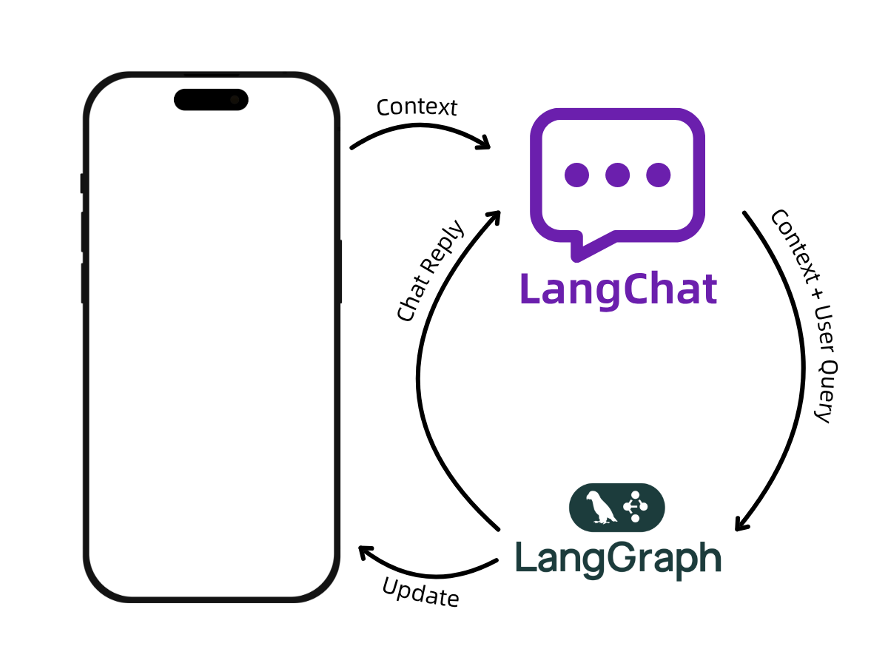

# LangChat - Smart Chat App for Your Business 💬

A powerful mobile chat application that connects your business apps with AI workflows. Perfect for business owners and app developers who want to add intelligent conversations to their mobile applications.

## 🎯 What Does This Do?

LangChat helps you build smart chat features for your mobile apps. Instead of just basic messaging, you get:

- **Smart Conversations**: Chat that understands context and handles complex business processes
- **Real-Time Updates**: Changes in your app instantly update the conversation, and vice versa
- **Business Workflows**: Connect chat to your existing business processes and automations
- **Professional Ready**: Built for real businesses that need reliable, scalable chat solutions



## 🚀 Getting Started

### What You Need
- A business mobile app project
- Basic app development knowledge
- An AI workflow system (we'll help you set this up)

### Prerequisites
- React Native/Expo development environment
- iOS Simulator, Android Emulator, or physical device
- Basic app development knowledge
- An AI workflow system (we'll help you set this up)

**Important:** For swipe gesture functionality, ensure `react-native-gesture-handler` is properly installed and configured:

```bash
npm install react-native-gesture-handler
```

**Note:** The `GestureHandlerRootView` is automatically included within the ChatScreen component, so you don't need to wrap your app with it manually. The package handles gesture setup internally.

For React Native CLI projects, follow the [installation guide](https://docs.swmansion.com/react-native-gesture-handler/docs/installation) for platform-specific setup.

### Quick Setup
1. **Download and install**
   ```bash
   npm install
   ```

2. **Start building**
   ```bash
   npx expo start
   ```

3. **Connect your business logic**

## 🎨 Features & Customization

### Interface & Themes
- **Light/Dark/Auto Theme**: Professional appearance that matches user preferences
- **Brand Customization**: Style messages with your brand colors
- **Rich Content**: Support for tables, lists, formatted text, images, and documents
- **Mobile Optimized**: Works great on both iPhone and Android

### Business Integration
- Connects to existing business systems
- Automates routine tasks through chat
- Tracks and manages customer interactions
- Updates your app based on conversations

### Thread Management (New! 🆕)
- **Smart Thread Creation**: Automatically creates threads only when needed
- **Floating Threads Panel**: Easily access and manage conversation threads
- **Create New Threads**: Start fresh conversations with a single tap
- **Switch Between Threads**: Navigate between different conversation contexts
- **Thread History**: View and manage previous conversations
- **Delete Threads**: Remove unwanted conversation threads
- **No Thread Indicator**: Visual feedback when no thread is selected

**How to Enable Threads Panel:**
```jsx
<ChatScreen
  showThreadsPanel={true} // Enable the floating threads panel
  // ... other props
/>
```

**Smart Behavior:**
- When `showThreadsPanel={false}`: Automatically creates a thread on startup
- When `showThreadsPanel={true}`: Only creates threads when user selects "New Thread" or sends first message
- Prevents unnecessary thread creation when user wants to select from existing threads

**Features:**
- Slide-out panel from the left side
- Create new threads with optional titles
- Switch between existing threads
- Delete unwanted threads
- Visual indicator when no thread is active
- Automatic thread management with LangGraph integration

### Message Management (New! 🆕)
- **Individual Message Deletion**: Delete specific messages with trash icon or swipe gesture
- **Batch Message Selection**: Long-press to enter selection mode, select multiple messages
- **Swipe to Delete**: Swipe left on any message to quickly delete it
- **Undo Functionality**: Recover recently deleted messages with one-tap undo
- **Floating Action Button**: Quick access to message selection mode
- **Keyboard Shortcuts**: Delete/Backspace keys for batch deletion (web platforms)

**How to Enable Message Management:**
```jsx
<ChatScreen
  showMessageActions={true} // Enable message deletion features
  // ... other props
/

// Or use MessageList directly
<MessageList
  messages={messages}
  showMessageActions={true}
  onDeleteMessage={(messageId) => console.log('Delete:', messageId)}
  onBatchDeleteMessages={(messageIds) => console.log('Batch delete:', messageIds)}
  theme={theme}
/>
```

**Features:**
- Individual delete via swipe gestures (no delete icons beside messages)
- Swipe-to-delete with minimum threshold (20px) - below threshold allows vertical scrolling
- Long-press to enter multi-selection mode
- Batch operations with "Select All" and "Cancel" options
- Visual feedback with selection indicators and delete background on swipe
- Undo toast with 30-second recovery window
- Floating action button for quick access to selection mode
- Keyboard shortcuts for power users (web platforms)
- Smart gesture detection that prioritizes vertical scrolling for small movements

### Technical Benefits
- Fast, responsive performance
- Secure business-grade encryption
- Easy updates and maintenance
- Scales with business growth

## 💼 Business Benefits

- **Reduce Support Costs**: Automate common customer questions
- **Increase Sales**: Smart conversations that guide customers to purchase
- **Improve Efficiency**: Connect chat directly to your business processes
- **Better Customer Experience**: Instant, intelligent responses
- **Data Insights**: Track and analyze customer interactions

## 🤝 Support & Contact

Need assistance with your implementation?
- Create a support ticket and leave your questions
- Schedule a consultation or demo call
- Browse our help center and step-by-step guides

---

**Transform your mobile app with intelligent conversations that understand your business.**
